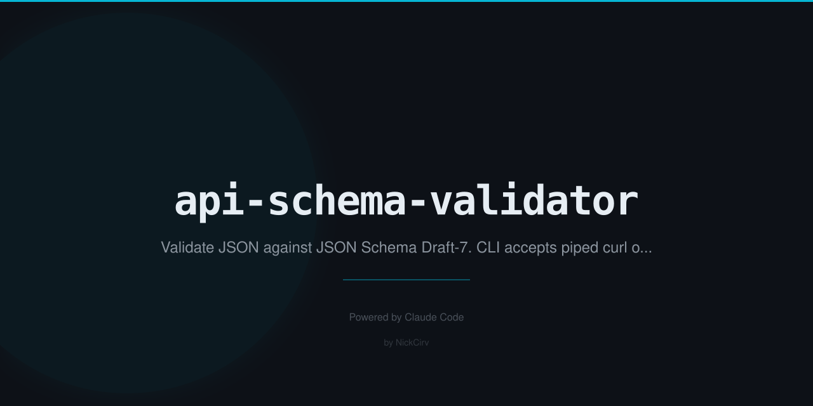

# api-schema-validator

> Validate JSON against JSON Schema. Pipe from curl. Zero dependencies.

[](https://nodejs.org)
[](LICENSE)
[](package.json)

---

## Install

**Use directly without installing:**
```bash
npx api-schema-validator --schema schema.json --data data.json
```

**Or install globally:**
```bash
npm install -g api-schema-validator
```

Both `api-schema-validator` and the shorter alias `jsv` are available after install.

---

## Quick Start

```
# Pipe from curl — the main use case
curl -s https://api.example.com/users/1 | jsv --schema user.schema.json

# Validate a local file
jsv --schema schema.json --data response.json

# Validate an entire fixtures directory
jsv --schema schema.json --dir tests/fixtures/

# Generate a schema from sample data
jsv --generate sample.json > schema.json

# GitHub Actions output (::error annotations)
jsv --schema schema.json --data data.json --format github
```

**Example output:**
```
✗ data.json — 3 errors:
  [/user/email] "notanemail" does not match format "email"
  [/user/age] -5 is less than minimum 0
  [/tags/2] expected string, got number
```

---

## Options

| Flag | Description |
|------|-------------|
| `--schema <file>` | JSON Schema file (required for validation) |
| `--data <file>` | JSON file to validate |
| `--url <url>` | Fetch JSON from URL and validate |
| `--dir <dir>` | Validate all `.json` files in directory |
| `--generate <file>` | Infer a JSON Schema from a sample JSON file |
| `--format table\|json\|github` | Output format (default: `table`) |
| `--coerce` | Coerce strings to numbers/booleans before validating |
| `--bail` | Stop on first error per file |
| `--verbose` | Show passing validations too |
| `--help`, `-h` | Show help |
| `--version`, `-v` | Print version |

---

## Exit Codes

| Code | Meaning |
|------|---------|
| `0` | All inputs valid |
| `1` | Validation errors found |
| `2` | Parse or network error |

---

## Output Formats

### `--format table` (default)
Human-readable with colour-coded pass/fail and error paths.

### `--format json`
Machine-readable JSON — great for scripts and dashboards:
```json
{
  "file": "data.json",
  "valid": false,
  "errors": [
    "[/user/email] \"notanemail\" does not match format \"email\""
  ]
}
```

### `--format github`
GitHub Actions annotations:
```
::error title=Validation Error::data.json [/user/email] "notanemail" does not match format "email"
```

---

## Supported JSON Schema Draft-7 Keywords

### Types
`string` `number` `integer` `boolean` `null` `array` `object`

### String
`minLength` `maxLength` `pattern` `format`

Supported formats (regex-based, no network calls):
- `email` — basic email pattern
- `uri` — scheme-based URI
- `date` — `YYYY-MM-DD`
- `date-time` — ISO 8601
- `uuid` — UUID v1–v5

### Number
`minimum` `maximum` `exclusiveMinimum` `exclusiveMaximum` `multipleOf`

### Array
`items` (schema + tuple) `minItems` `maxItems` `uniqueItems` `contains` `additionalItems`

### Object
`properties` `required` `additionalProperties` `patternProperties` `minProperties` `maxProperties`

### Logic / Combinators
`allOf` `anyOf` `oneOf` `not` `if` / `then` / `else`

### References
`$ref` — local JSON Pointer refs within the same schema file (e.g. `#/definitions/Address`)

### Misc
`enum` `const`

---

## Examples

**Validate live API response:**
```bash
curl -s https://jsonplaceholder.typicode.com/users/1 | jsv --schema user.schema.json
```

**CI pipeline — fail fast:**
```bash
jsv --schema api.schema.json --data build/response.json --bail --format github
```

**Batch fixture validation:**
```bash
jsv --schema schema.json --dir tests/fixtures/
# 12/12 valid
```

**Schema inference from sample:**
```bash
jsv --generate sample-response.json > schema.json
# Edit and refine, then validate
jsv --schema schema.json --data sample-response.json
```

**Coerce query params (strings from URL args):**
```bash
echo '{"limit":"10","active":"true"}' | jsv --schema params.schema.json --coerce
```

**JSON output for scripting:**
```bash
jsv --schema schema.json --data data.json --format json | jq '.errors[]'
```

---

## Schema Example

```json
{
  "$schema": "http://json-schema.org/draft-07/schema#",
  "type": "object",
  "required": ["id", "email", "age"],
  "properties": {
    "id":    { "type": "integer", "minimum": 1 },
    "email": { "type": "string",  "format": "email" },
    "age":   { "type": "integer", "minimum": 0, "maximum": 150 },
    "tags":  { "type": "array",   "items": { "type": "string" }, "uniqueItems": true }
  },
  "additionalProperties": false
}
```

---

## Why Zero Dependencies?

- No `npm install` needed — works instantly in CI
- No supply chain risk
- Ships as a single `index.js` file
- Node 18 builtins cover everything needed: `fs`, `path`, `https`, `http`, `readline`

---

## Limitations

- `$ref` supports local JSON Pointer references only (`#/...`). External URLs or files are not resolved.
- `format` validation is regex-based — no DNS lookups or network calls.
- Does not support JSON Schema vocabularies beyond Draft-7.

---

## License

MIT

---

Built with Node.js · Zero dependencies · MIT License
